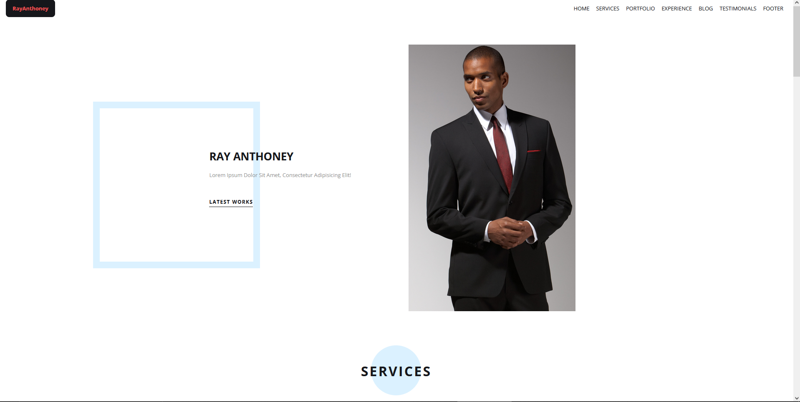

# Codingphase Practical JavaScript project "Branding Portfolio"

 
 
 

<!-- Banner Section -->
<h2 align="center">🛠️ Projects</h2>

 
 

    

 
 

    
    

 

## 🎨 This project was built using these technologies.

 

<strong>JavaScript, CSS3, HTML5</strong> - JavaScript version of a Branding Portfolio created within the Codingphase "Web Developer Personal Brand" course.

 

&nbsp;
&nbsp;&nbsp;
&nbsp;&nbsp;

