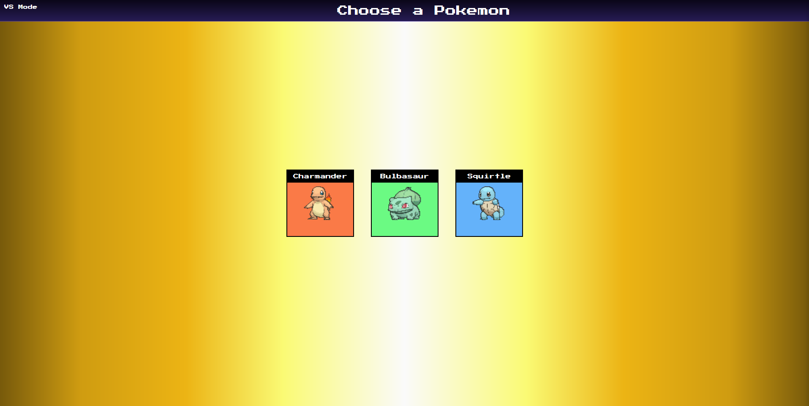

# Codingphase Practical JavaScript project "Pokemon Game Lab"

 
 
 

<!-- Banner Section -->
<h2 align="center">🛠️ Projects</h2>

 
 

    

 
 

    
    

 

## 🎨 This project was built using these technologies.

 

<strong>JavaScript, CSS3, HTML5</strong> - JavaScript version of a Pokemon Game Lab created within the Codingphase "Future Proof JavaScript" course.

 

&nbsp;
&nbsp;&nbsp;
&nbsp;&nbsp;

 
 

# Starter-Kit-2018

So I built this for all the new web developers... My Goal is to save you time from the bullsh\*t of spending hours looking for ways to speed up your learning. Sometimes all we want to do is just code.
(if you are coming from my [youtube channel CodingPhase ](https://www.youtube.com/channel/UC46wWUso9H5KPQcoL9iE3Ug) I will base all my tutorials from this starter kit)

I broke it down in simple steps to get you going.

## **Steps**

**Download or Pull This Repo**
Top of this page you can see where it says clone or download

**Install Node**
https://nodejs.org/en/

<!-- **Download Atom**
https://atom.io/ -->

**Install all the node packages**
On the root of this project run on your terminal (if you want you can do this with yarn but thats optional)

    npm install

**Update the node packages**
On the root of this project run on your terminal (if you want you can do this with yarn but thats optional)

    npm update

**Start the server**

    npm run watch
